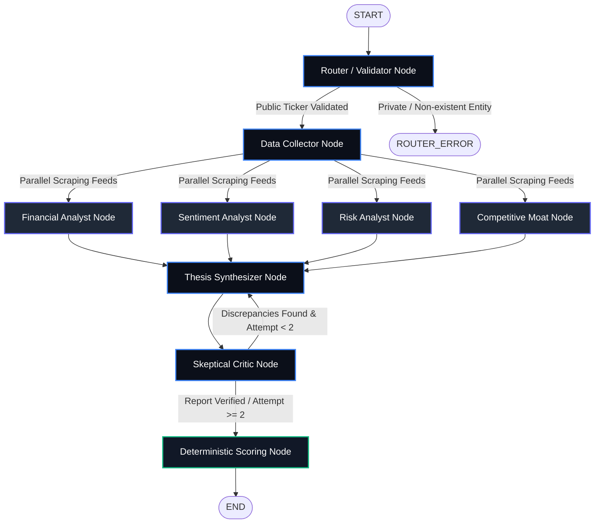

# Multi-Agent LangGraph Architecture

InvestIQ AI relies on a modular state machine engineered with LangGraph.js to coordinate data scrapers, quantitative analysts, and edit reviews.

---

## 🧠 System Architecture Diagram

This flowchart maps the execution lifecycle, showing parallel analyst execution, Critic review retry loops, and final verdict compilation:

---

## 📂 LangGraph State Annotation Channels

The shared state object acts as the Annotation Root, accumulating analyst variables as nodes converge:

| State Key | Type | Description |
| :--- | :--- | :--- |
| `companyName` | `string` | Normalized target search name entered by the investor. |
| `symbol` | `string` | Resolved market ticker symbol (e.g. `AAPL`, `NVDA`). |
| `rawData` | `object` | Raw inputs containing financials overview, news articles list, and Tavily competitors snippets. |
| `financialAnalysis` | `object` | Financial strength rating, PE/EPS metrics, and growth pros/cons. |
| `sentimentAnalysis` | `object` | Headline sentiment score, bias rating (Positive/Neutral), and pros/cons. |
| `riskAnalysis` | `object` | Risk volatility score (0-100), key flags list, and mitigation drivers. |
| `competitiveAnalysis`| `object` | Economic Moat score (0-100), peer benchmarks list, and barriers list. |
| `synthesizedReport` | `object` | Thesis summary and consolidated analyst category text blocks. |
| `criticFeedback` | `object` | Skeptic edit comments list and execution loop counter. |
| `progressLog` | `array` | Incremental streaming records displaying active agent actions. |
| `error` | `string/null` | Error intercept messages halting graph execution. |
